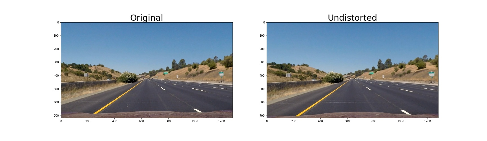

# **Advanced Lane Finding Project**

## Outline

The goals / steps of this project are the following:

* Compute the camera calibration matrix and distortion coefficients given a set of chessboard images.
* Apply a distortion correction to raw images.
* Use color transforms, gradients, etc., to create a thresholded binary image.
* Apply a perspective transform to rectify binary image ("birds-eye view").
* Detect lane pixels and fit to find the lane boundary.
* Determine the curvature of the lane and vehicle position with respect to center.
* Warp the detected lane boundaries back onto the original image.
* Output visual display of the lane boundaries and numerical estimation of lane curvature and vehicle position.

I've implemented these items step by step in the notebook file located at `./Advanced_Lane_Lines.ipynb`.

## Detail

This writeup is following this [rublic](https://review.udacity.com/#!/rubrics/571/view).

### Camera Calibration

#### 1. Briefly state how you computed the camera matrix and distortion coefficients. Provide an example of a distortion corrected calibration image.

The code for this step is contained in cells [3] and [4] in my notebook.

I start by preparing "object points", which will be the (x, y, z) coordinates of the chessboard corners in the world. Here I am assuming the chessboard is fixed on the (x, y) plane at z=0, such that the object points are the same for each calibration image.  Thus, `objp` is just a replicated array of coordinates, and `objpoints` will be appended with a copy of it every time I successfully detect all chessboard corners in a test image.  `imgpoints` will be appended with the (x, y) pixel position of each of the corners in the image plane with each successful chessboard detection.  

I then used the output `objpoints` and `imgpoints` to compute the camera calibration and distortion coefficients using the `cv2.calibrateCamera()` function.  I applied this distortion correction to the test image using the `cv2.undistort()` function and obtained this result: 


### Pipeline (single images)

#### 1. Provide an example of a distortion-corrected image.

To demonstrate this step, I will describe how I apply the distortion correction to one of the test images like this one:


I've applied camera parameters `mtx, dist`, which I calculated in the calibration step, to this image using `cv2.undistort()` function.
Here's an example of my output for this step.



#### 2. Describe how (and identify where in your code) you used color transforms, gradients or other methods to create a thresholded binary image.  Provide an example of a binary image result.

I used a combination of color and gradient thresholds to generate a binary image (thresholding steps at cell [5]`).
Here's an example of my output for this step.


#### 3. Describe how (and identify where in your code) you performed a perspective transform and provide an example of a transformed image.

The code for my perspective transform includes a function called `apply_perspective_transform()`, which appears in cell [6].
The function takes as inputs an image (`img`), as well as source (`src`) and destination (`dst`) points.
I chose the hardcode the source and destination points in the following manner:

```python
src_tl = [0.45 * width, 0.63 * height]
src_tr = [0.55 * width, 0.63 * height]
src_br = [0.90 * width, 1.00 * height]
src_bl = [0.10 * width, 1.00 * height]
src = np.float32([src_tl, src_tr, src_br, src_bl])

dst_tl = [0.10 * width, 0.00 * height]
dst_tr = [0.90 * width, 0.00 * height]
dst_br = [0.90 * width, 1.00 * height]
dst_bl = [0.10 * width, 1.00 * height]    
dst = np.float32([dst_tl, dst_tr, dst_br, dst_bl])
```

Here's an example of my output for this step.


#### 4. Describe how (and identify where in your code) you identified lane-line pixels and fit their positions with a polynomial?

Then I did some other stuff, which appears in cell [7], and fit my lane lines with a 2nd order polynomial like this:


#### 5. Describe how (and identify where in your code) you calculated the radius of curvature of the lane and the position of the vehicle with respect to center.

I did this in cell [8].
It's important to convert pixel-size to real-size using `ym_per_pix` and `xm_per_pix`.

#### 6. Provide an example image of your result plotted back down onto the road such that the lane area is identified clearly.

I implemented this step in cell [9].
Here is an example of my result on a test image:


---

### Pipeline (video)

#### 1. Provide a link to your final video output.  Your pipeline should perform reasonably well on the entire project video (wobbly lines are ok but no catastrophic failures that would cause the car to drive off the road!).

Here's a [link to my video result](./test_videos_output/project_video.mp4)

---

### Discussion

#### 1. Briefly discuss any problems / issues you faced in your implementation of this project.  Where will your pipeline likely fail?  What could you do to make it more robust?

In this [this video](./test_videos_output/challenge_video.mp4), for example, my pipeline fails when:

* the image becomes dark under a bridge.
* there are yellow lines
* the color of road surfaces are different and there are other edges

I think one reason of this is because I use manual threthold(s_thresh=(170, 255), sx_thresh=(20, 100)) when creating binary image.
Probably, I can improve this by adaptively setting these parameters.
